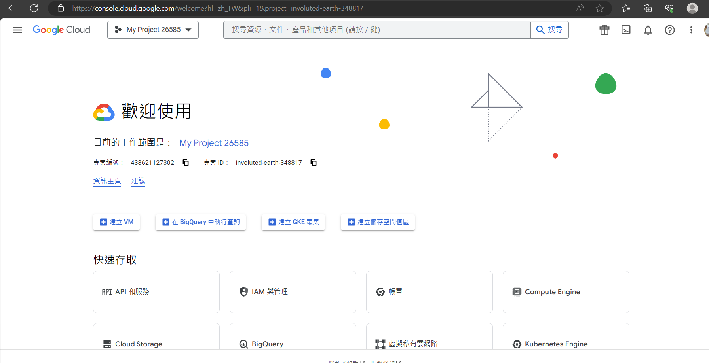
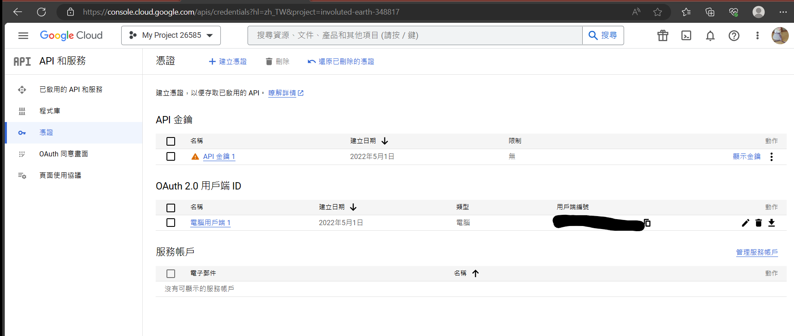
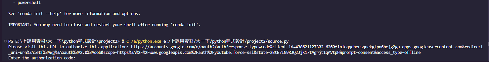
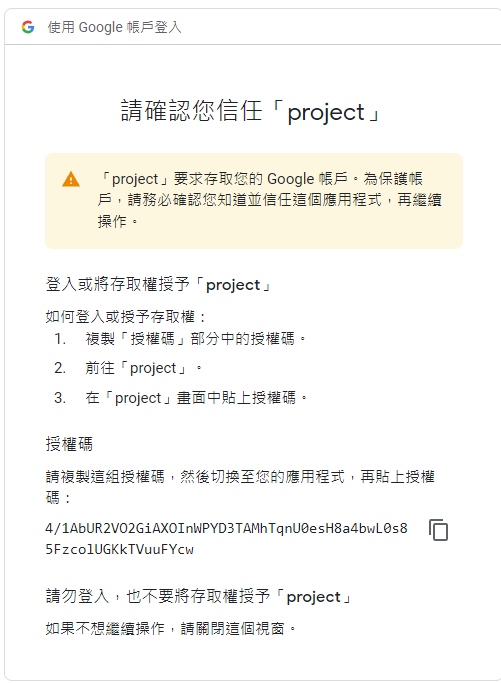

# Youtube 播放清單管理
##目錄
- [Youtube 播放清單管理](#youtube-播放清單管理)
  - [創建自己的API](#創建自己的api)
    - [申請](#申請)
    - [認證](#認證)
  - [Demo](#demo)
  - [開始使用youtube api](#開始使用youtube-api)

## 創建自己的API

### 申請
在操作這個專案之前，需要先驗證你的google帳號，最好是已經有頻道的youtube帳號
接下來，需要進行驗證以及申請，請進[Google Cloud Platform](https://console.cloud.google.com)
你會看到這個畫面:


接下來，在API和服務中，點入「憑證」，分別創建API金鑰跟OAuth 2.0 用戶端 ID
完成之後的結果如下所示:


最後，需要下載OAuth 2.0 用戶端的.json檔，點擊畫面最左邊的「下載OAuth用戶端」，**放進跟這個專案一樣的資料夾內**，名稱改成你喜歡的名稱。
注意!!  在程式碼中記得修改檔案名稱!


```py
client_secrets_file = "your_file_name.json" #remember to change name here !
```

### 認證

執行程式的時候會出現下面的結果，我們要做的就是去這個網址去做確認「是否信任這個專案」
將這個網址的授權碼貼到底下的地方


授權碼登入畫面如圖所示:



授權完畢之後就可以開始使用了!

大功告成，接下來是實作的部分

## Demo 

礙於篇幅的關係，這邊我放一個PDF檔案，DEMO流程都在裡面!

[PDF for demo !](./demo.pdf)


## 開始使用youtube api

* https://developers.google.com/youtube/v3/getting-started

* https://developers.google.com/youtube/registering_an_application